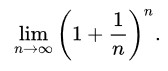
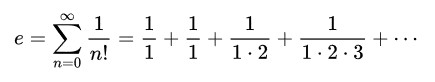

# Euler's Number

This is derived from my [blog post](http://blogs.perl.org/users/laurent_r/2019/08/perl-weekly-challenge-21-eulers-number-and-url-normalizing.html) made in answer to the [Week 21 of the Perl Weekly Challenge](https://perlweeklychallenge.org/blog/perl-weekly-challenge-021/) organized by  <a href="http://blogs.perl.org/users/mohammad_s_anwar/">Mohammad S. Anwar</a> as well as answers made by others to the same challenge.

The challenge reads as follows:

*Write a script to calculate the value of e, also known as Euler’s number and Napier’s constant. Please checkout this [wiki page](https://en.wikipedia.org/wiki/E_(mathematical_constant)) for more information.*

The number *e* is a mathematical constant that is the base of natural logarithms: it is the unique number whose natural logarithm is equal to 1 and its value is approximately 2.71828.

## My Solution

Perl 6 has a built-in constant, `e`, for Euler's number, which we can just print in a Perl 6 one-liner:

    $ perl6 -e 'say e'
    2.718281828459045

If you did not know about this special built-in constant in Perl 6, you could still print the exponential of 1 (and that one-liner also works in exactly the same way in Perl 5):

    $ perl6 -e 'say exp 1'
    2.718281828459045

So, job done? Well, maybe it is sort of cheating, and we don't want to cheat. Let's try to compute *e* really.

Let's try the formula investigated by Jacob Bernoulli in 1683: *e* is equal to this limit:



We can just use this formula with a large input number:

``` perl6
use v6;

sub eul ($n) { (1 + 1/$n)**$n}

sub MAIN (Int $n) {
    say eul $n;
}
```
 
Let's try to run this program with increasing input numbers:

    $perl6  euler.p6 5
    2.48832

    $perl6  euler.p6 10
    2.5937424601

    $perl6  euler.p6 100
    2.7048138294215263

    $perl6  euler.p6 1000
    2.7169239322358925

    $perl6  euler.p6 10000
    2.718145926825225

It works, but the formula converges very slowly: with an input number of 10,000, we obtain only 4 correct digits. 

Let's try with a better formula. Isaac Newton found in 1669 that what is known as Euler's constant is equal to the  sum of the following infinite series (sometimes called the Maclaurin series expansion):



 where `n!` is the factorial of `n`, i.e. the product of all positive integers between 1 and `n`.

For computing this, we will first define a new postfix operator, `!`, to compute the factorial of any number, and then use it to compute the sum. For this, we will use twice the `[...]` reduction metaoperator, which reduces a list of values with the given infix operator. For example,

``` perl6
say [+] 1, 2, 3, 4;   #  -> 10
```

is equivalent to:

``` perl6
say 1 + 2 + 3 + 4;
```

i.e. works as if the infix operator (`+` in this example) was placed between each item of the list to produce an arithmetic expression yielding a single numerical value. This is the perfect functionality for computing both the factorial of an integer and the sum of terms of the formula.

``` perl6
use v6;

sub postfix:<!> (Int $n) {   # factorial operator
    [*] 2..$n;
}
sub eul (Int $n) {
    [+] map { 1 / $_! }, 0..$n;
}
sub MAIN (Int $n) {
    say eul $n;
}
```

The version with this new formula converges much faster than the original one:

    $ perl6  euler.p6 10
    2.7182818

    $ perl6  euler.p6 25
    2.718281828459045

The digits are all accurate, but if we wanted more significant digits, we would need to use `FatRat` numbers. For example, like so:

``` perl6
sub postfix:<!> (Int $n) {   # factorial operator
    [*] (2..$n).FatRat;
}
```

or, probably better, by making the change in the `eul` subroutine rather than in the definition of the factorial operator:

``` perl6
sub eul (Int $n) {
    [+] map { 1 / ($_!).FatRat}, 0..$n;
}
```

With this last change, the script outputs significantly more accurate digits:

    perl6 euler.p6 25
    2.7182818284590452353602875

and can display many more with higher input values.

## Alternative Solutions

There is more than on way to do it. In some cases in the past, many solutions to the Perl Weekly Challenge looked similar. Not so with Euler's number: challengers used quite a number different formulas to compute *e* and, even when they used the same formula, the implementations were markedly different.

[Arne Sommer](https://github.com/manwar/perlweeklychallenge-club/blob/master/challenge-021/arne-sommer/perl6/ch-1.p6) used the same formula as my second one above, but coded it very differently: he made a lazy infinite list of the `1/n!` terms and and then computed the sum for the *j* terms. 

[Ozzy](https://github.com/manwar/perlweeklychallenge-club/blob/master/challenge-021/ozzy/perl6/ch-1.p6) also used the same formula, but yet with a totally different coding approach; the distinctive quality of his solution is that he first defines a default precision of one hundred digits after the decimal point, and loops on his formula until he effectively gets more than 100 correct digits. This is the result I get with Ozzy's code:

    2.7182818284590452353602874713526624977572470936999595749669676277240766303535475945713821785251664274263

(The last two digits displayed above (63) are wrong, but that's nonetheless 102 correct first digits.) Congratulations!

[Simon Proctor](https://github.com/manwar/perlweeklychallenge-club/blob/master/challenge-021/simon-proctor/perl6/ch-1.p6), [Joelle Maslak](https://github.com/manwar/perlweeklychallenge-club/blob/master/challenge-021/joelle-maslak/perl6/ch-1.p6), [Roger Bell West](https://github.com/manwar/perlweeklychallenge-club/blob/master/challenge-021/roger-bell-west/perl6/ch-1.p6), [Ruben Westerberg](https://github.com/manwar/perlweeklychallenge-club/blob/master/challenge-021/ruben-westerberg/perl6/ch-1.p6), and [Randy Lauen](https://github.com/manwar/perlweeklychallenge-club/blob/master/challenge-021/randy-lauen/perl6/ch-1.p6) also used the same sum of infinite series formula, but each with a very different coding approach. Roger did it in an infinite loop printing each value found for *e*, so that you need to kill the process to finish it (which I don't like too much), but it prints the various successive approximations, so that you can see the precision increase at each iteration, and this, I like very much. I added a `last` statement in his code in order to exit gracefully the infinite loop after a given number of iterations and got this:

    2
    2.5
    2.666667
    2.708333
    2.716667
    2.718056
    2.718254
    2.718279
    2.718282
    2.718281801
    2.718281826
    2.7182818283
    2.718281828447
    2.7182818284582
    2.71828182845899
    2.7182818284590423
    2.718281828459045
    2.718281828459045227
    2.7182818284590452
    2.71828182845904523534
    2.7182818284590452353594
    2.71828182845904523536025
    2.71828182845904523536029
    2.7182818284590452353602874

[Adam Russell](https://github.com/manwar/perlweeklychallenge-club/blob/master/challenge-021/adam-russell/perl6/ch-1.p6) played with channels presumably to test concurrent or distributed computing in order to boost performance. Looking at his solution, it seemed to me that Adam was using the same sum of infinite series as the previous challengers just above, but I must admit that I originally didn't really understand his method. It became clear to me only afterward when I read his [Implementing a spigot algorithm for the digits of e](https://adamcrussell.livejournal.com/6924.html) blog post, so you might probably want to do the same.


[Kevin Colyer](https://github.com/manwar/perlweeklychallenge-club/blob/master/challenge-021/kevin-colyer/perl6/ch-1.p6) apparently has quite a bit of fun with that and suggested not less than 5 different ways of computing *e*: the two formulas I gave at the beginning of this post, two continued fractions and even a probabilistic or stochastic computation. I had probably the same  amount of fun reading and trying his solutions as he did writing them, and I think you should really follow the link and read his solutions to enjoy the same fun. This one of his subroutines, for the fun:

```Perl6
sub e_continued_fraction($n) {
    # calculated in reverse order to avoid recursion
    my $frac=1;
    my @seq=lazy gather for 1..Inf  -> $a  {take 1; take 2*$a; take 1} ;
    for (0..^$n).reverse -> $i {
        $frac=1/(@seq[$i]+$frac);
    }
    return $frac+2;
};
```

[Noud](https://github.com/manwar/perlweeklychallenge-club/blob/master/challenge-021/noud/perl6/ch-1.p6) used the following continued fraction:


and computed it for the first 50 steps (which yields 2.7182818284590455).

[Athanasius](https://github.com/manwar/perlweeklychallenge-club/blob/master/challenge-021/athanasius/perl6/ch-1.p6) used yet another, much more recent and apparently significantly  faster, method suggested in Jan. 2004 by Harlan J. Brothers in a paper entitled [Improving the Convergence of Newton's Series Approximation for e](http://www.brotherstechnology.com/docs/Improving_Convergence_(CMJ-2004-01).pdf).

[Jaldar H Vyas](https://github.com/manwar/perlweeklychallenge-club/blob/master/challenge-021/jaldhar-h-vyas/perl6/ch-1.sh) cheated as blatantly as I did in my first suggestion, also with a code length of a mere 5 characters, but yet managed to do it with a different syntax (method call syntax). Yes, TIMTOWTDI.

## See Also

Not many blog posts this week:

* Arne Sommer: https://perl6.eu/eulers-url.html
* Adam Russell: https://adamcrussell.livejournal.com/6924.html
* Roger Bell West: https://blog.firedrake.org/archive/2019/08/Perl_Weekly_Challenge_21.html

## Wrapping up

Please let me know if I forgot any of the challengers or if you think my explanation of your code misses something important.

If you want to participate to the Perl Weekly Challenge, please connect to [this site](https://perlweeklychallenge.org/).

